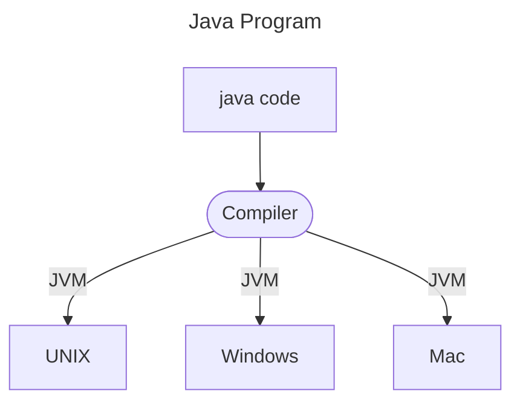

### 第一支java

Java 虛擬機，確保相同的 Java 程式碼能在不同的作業系統和平台上執行。

```mermaid
---
title: Java Program
---
graph TD;
    A[java code]
    B([Compiler])
    C[UNIX]
    D[Windows]
    E[Mac]

    A-->B;
    B-- JVM -->C;
    B-- JVM -->D;
    B-- JVM -->E;
```

`javac 檔名.java` -> 編譯為class
`java 檔名` -> 執行`main（）`中程式